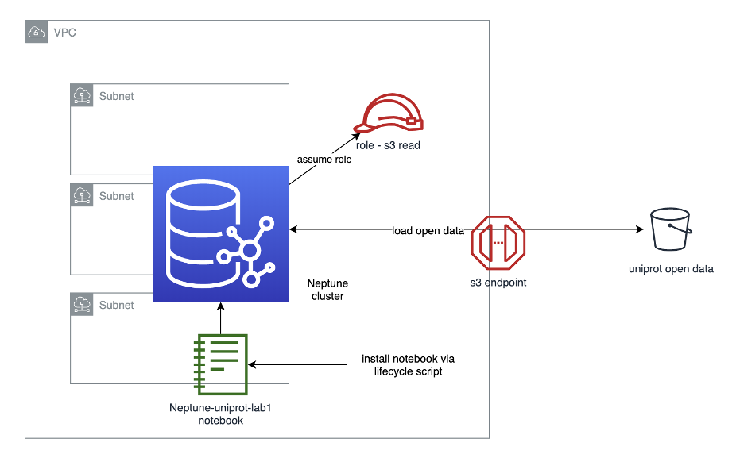

# Explore UniProtKB with Amazon Neptune

## Introduction
The [Universal Protein Resource (UniProt)](https://www.uniprot.org/) is a widely used resource of protein data that is now available through the Registry of Open Data on AWS. Its centerpiece is the [UniProt Knowledgebase (UniProtKB)](https://www.uniprot.org/help/uniprotkb), a central hub for the collection of functional information on proteins, with accurate, consistent and rich annotation. UniProtKB data is highly structured with many relationships between protein sequences, annotations, ontologies and other related data sources. UniProt can be directly accessed via the [UniProt website](https://www.uniprot.org/) and is available for bulk downloads in several formats, including RDF which is particularly well suited to represent the complex and connected nature of the data as a graph. Creating a custom knowledge base can enable more advanced use cases, such as joining with other data sources, augmenting data with custom annotations and relationships, or inferring new relationships with analytics or machine learning.

In this example, we will demonstrate the step-by-step process to create and use your own protein knowledge base using UniProt RDF data. We will show how to ingest a subset of UniProtKB data into your own Amazon Neptune database directly from the Registry of Open Data on AWS. We will then show how to query the data with SPARQL, create new relationships in the data and visualise the data as a graph.

## How to run this example

If you would like to try this example yourself, there is a cloud formation stack that can be run within your own AWS account. If your region is not listed, you can modify the launch link and replace with your region.

| Region | Launch Template |
|-|-|
| Europe (Paris) *eu-west-3* ||
| US East (N. Virginia) *us-east-1* ||
| Asia Pacific (Singapore) *ap-southeast-1* ||
| Asia Pacific (Sydney) *ap-southeast-2* ||

The cloud formation stack will create the following resources:

- A VPC with Subnets, Internet Gateway, NAT Gateway, Routing Tables, and Security Groups 
- The NeptuneDB cluster and instance
- An IAM role used to load data from the AWS Open Data Registry
- An S3 VPC endpoint for Neptune to access the open data bucket
- An Amazon SageMaker notebook to load the data and query the database

The resources provisioned via the CloudFormation stack are shown in the below diagram:

The total time to run the lab is approximately one hour. To load the dataset into the Neptune instance as quickly as possible, we use a large writer instance *db.r5.8xlarge* which is not covered by the AWS free tier. This will cost approximately 9 USD. Once the data is loaded we should switch to a smaller instance to minimize costs. Here is a detailed cost estimation for loading data in the eu-west-3 region:

  | Item | Unit Price  | Unit | Cost |
  | ----------- | ----------- | ----------- | ----------- |
  | Instance hour (db.r5.8xlarge) | 6.456 per hour    | 1 | 6.456 |
  | Storage IO Usage | 0.22 per million IO     | 10  | 2.2 |
  | Storage Usage | 0.11 per GB per month    | 0.1 | 0.01 |

The actual costs will vary depending on region, but will be comparable. We will look more into loading times below. For more information on the costs for running Neptune, go [here](https://aws.amazon.com/neptune/pricing/).

### Open the Neptune Workstation Notebook 
Once we have run the Cloud Formation template, we can open the [Neptune Workbench Notebook](https://docs.aws.amazon.com/neptune/latest/userguide/graph-notebooks.html) that was created. From the Neptune console, click on Notebooks, select the notebook, and then click the Open Notebook button.

